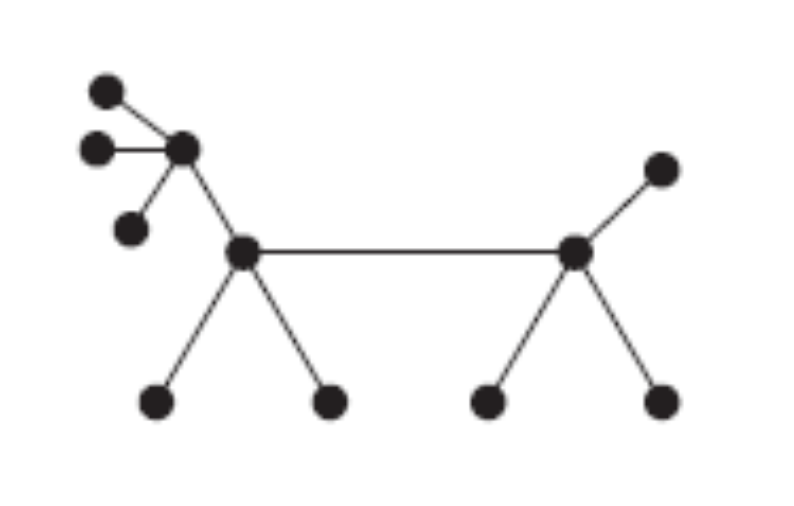

# Model an Undirected Graph with APIs to Create and Traverse
We have been asked to develop a Java program to model a undirected graph, including nodes and edges. We also need to develop the following APIs

## Add node
The first API should  enable adding a new node to the graph. With the added node, it will have no connection to any node.

## Add edge
The 'add edge' API allows creating an edge for nodes which are not connected directly or undirectly.  

## Traverse the tree
Given two nodes, we need a list of nodes which should be passed to reach from one node to the other.