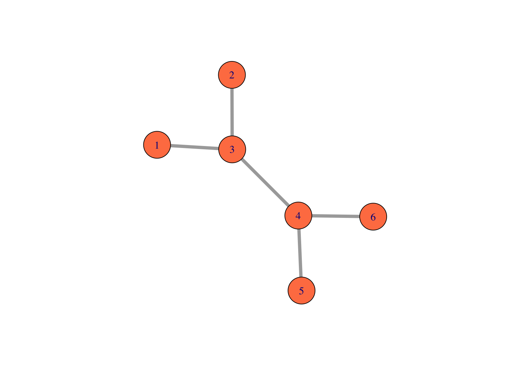

# Model Undirected Graph 
This is a simple practice to model an undirected graph with a couple of APIs (Create Node/Edges) and Traverse the graph. 

## Features
- Graph must not allow a circular path between nodes.
- To keep the practice simple, each node has only property called name.
- Edges can't have any name or even presented by a model. If a node can be reached by another node, it means there is an edge between them.
- To manipulate the graph, at-least two APIs are needed: 
    - Create node API, which enables adding a new node to the graph.
    - Add edge API, which allows creating an edge for nodes which are not connected directly or undirectly.  
    - Traverse API, which provides a list of nodes by which a node can be reached out to through the other node.